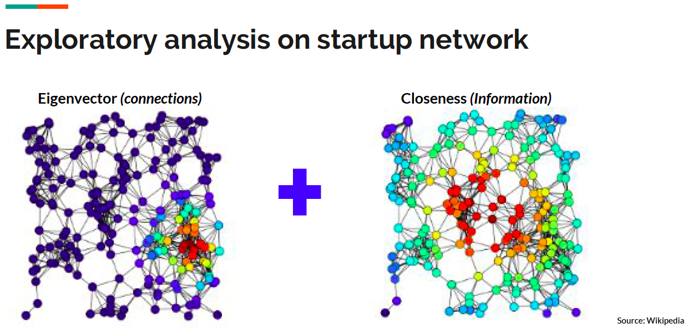
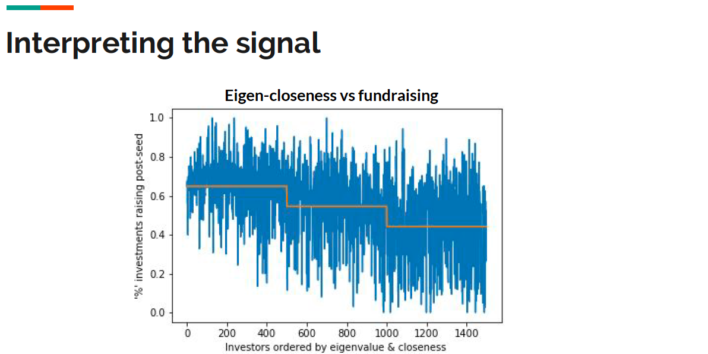
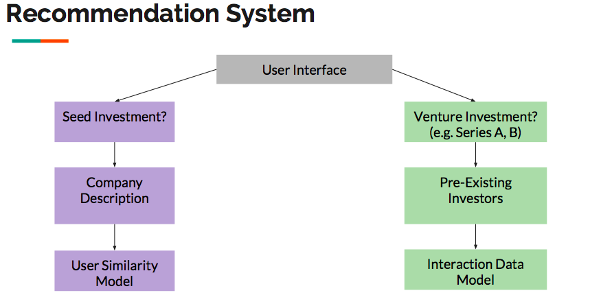

# Summary
There are over 15K startup investors globally making the fundraising process for startups arduous and inefficient.
The goal of this project is to use machine learning to provide targeted recommendations to startups on which investors are most likely to be interested in investing in their company.

This project utilized graph theory, a 16-year training set of investing data, and natural language processing techniques to make recommendations that achieved a 58% better recall on cross-validated data for predicting investor-startup matches than the baseline of simply recommending the N largest startup investors, which is a extremely encouraging first step in making the startup fundraising process better.

# Methodology
EDA: I plotted a network graph where the investors and startups were individual nodes and investments were directional edges connecting the nodes together. I looked at centrality measures, and found that a combination between eigenvector centrality (a proxy for how influential a node is) and closeness centrality (a proxy for the nodes information access in the network) showed a very strong positive  correlation to the percentage of an investors investments that went on to receive multiple rounds of financing.

I found this signal to be incredibly telling, as it led me to conclude that there is a relationship in the data which strongly suggests that investors investment decisions are in part driven by their relationship to other investors in the network. I corroborated this finding through interviews with several venture capital firms, who identified the 'follow-the-leader' strategy where firms will base their investment decisions based on the co-investors as it de-risks the investment in their eyes.

Model: Based on my EDA findings, I decided the best way to utilize this data was to build a recommender system that could recommend to start-ups who would be the most likely to be interested in investing in their company. I first built a item-similarity model which looked at a startups current investors, then recommended investors based on their investing history using the Jaccard similarity metric.

To account for startups that didn't have any preexisting investors, I built a second model which utilizing natural language processing techniques to vectorize a company's business description based on the co-occurence rates of words in a commonly crawled corpus that was used to identify similar companies. From this, I based my recommendations of investors that had shown interest in investing in that industry space.

Cross-validation: I utilized a modified k-fold cross-validation approach with 5 folds, where 20% of investors for all start-up companies were moved into a test set and the model was evaluated based on the ability to accurately predict those held out matches. For the baseline comparison, I assumed the N largest investors were the predictions made, which is representative for how currently most startup companies identify likely investors. I used recall as the metric to optimize for, as I am most concerned if my model can correctly identify investor-startup matches. I don't believe precision or accuracy are as important, as the incremental cost of speaking with more investors is low for startups.

# Results
The model's cross-validated results were averaged over 5-folds and our recall result was 12.8%. This result was a 58% improvement over the baseline recall of 8.1% which recommended based on the largest investors ranked by number of investments made.

The user-similarity model based on NLP wasn't scored given time constraints and also because the model's recall was expected to be low given the large number of possible investors and the limited signal available in recommending investors based solely on a company's description, especially for popular industry/technology application types. However, the model was still included as I believe there is tangible value in having the additional diverse recommendations that this model provides.

# Future Steps
Future steps include incorporating personnel data for each startup/investor team including where their partners/founders went to school and what was their previous work experience, which I believe has the potentially to significant boost recall given that investors place significant emphasis on the startup's team composition.

# Conclusion
The startup fundraising process is primed for machine learning optimization given the richness of the data set. I believe this project has shown that incremental improvements are possible, and can provide tangible value to startups in the fundraising process.
